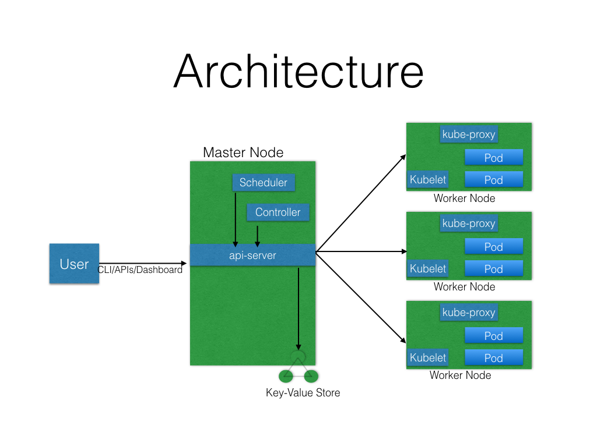
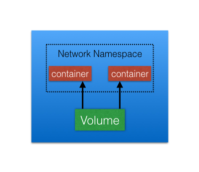
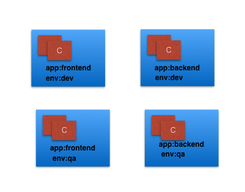
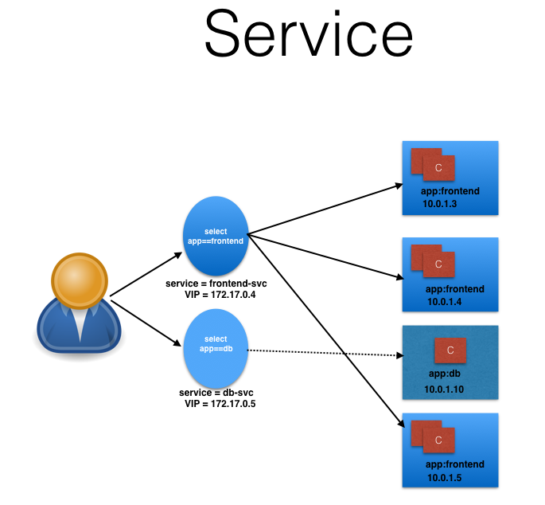

# Basic concept
## Architecture


## Master Node
The Master Node is responsible for managing the Kubernetes cluster, and it is the entry point for all administrative tasks.

A master node have following components

* API Server    
All the administrative tasks are performed via the API Server within the Master Node. A user/operator sends REST commands to the API Server, which then validates and processes the requests. After executing the requests, the resulting state of the cluster is stored in the distributed key-value store.
* Scheduler    
As the name suggests, the Scheduler schedules the work to different Worker Nodes. The Scheduler has the resource usage information for each Worker Node. It also knows about the constraints that users/operators may have set, such as scheduling work on a node that has the label disk==ssd set. Before scheduling the work, the Scheduler also takes into account the quality of the service requirements, data locality, affinity, anti-affinity, etc. The Scheduler schedules the work in terms of Pods and Services.
* Controller Manager    
The Controller Manager manages different non-terminating control loops, which regulate the state of the Kubernetes cluster. Each one of these control loops knows about the desired state of the objects it manages, and watches their current state through the API Server. In a control loop, if the current state of the objects it manages does not meet the desired state, then the control loop takes corrective steps to make sure that the current state is the same as the desired state.
  * Replication Controllers    
  A ReplicationController (rc) is a controller that is part of the Master Node's Controller Manager. It makes sure the specified number of replicas for a Pod is running at any given point in time.
    * ReplicaSets    
      next generation of Replication Controllers
  * DeploymentController    
    part of the Master Node's Controller Manager, and it makes sure that the current state always matches the desired state.
* etcd    
As discussed earlier, etcd is a distributed key-value store which is used to store the cluster state. It can be part of the Kubernetes Master, or, it can be configured externally, in which case, Master Nodes would connect to it.


## Worker Node
A Worker Node is a machine (VM, physical server, etc.) which runs the applications using Pods and is controlled by the Master Node. Pods are scheduled on the Worker Nodes, which have the necessary tools to run and connect them. **A Pod is the scheduling unit in Kubernetes. It is a logical collection of one or more containers which are always scheduled together**. We will explore them further in later chapters.

A worker node have following components

* Container Runtime    
To run containers, we need a Container Runtime on the Worker Node. By default, Kubernetes is configured to run containers with Docker. It can also run containers using the rkt Container Runtime.
* kubelet    
The kubelet is an agent which runs on each Worker Node and communicates with the Master Node. It receives the Pod definition via various means (primarily, through the API Server), and runs the containers associated with the Pod. It also makes sure the containers which are part of the Pods are healthy at all times.


* kube-proxy    
Instead of connecting directly to Pods to access the applications, we use a logical construct called a Service as a connection endpoint. **A Service groups related Pods, which it load balances when accessed. We will talk more about Services in later chapters.**
kube-proxy is the network proxy which runs on each Worker Node and listens to the API Server for each Service endpoint creation/deletion. For each Service endpoint, kube-proxy sets up the routes so that it can reach to it. We will explore this in more detail in later chapters.

## State management with etcd
As we mentioned earlier, Kubernetes uses etcd to store the cluster state.
In Kubernetes, besides storing the cluster state, etcd is also used to store configuration details such as subnets, ConfigMaps, Secrets, etc.


## Network

* A unique IP is assigned to each Pod
* Containers in a Pod can communicate to each other
* The Pod is able to communicate with other Pods in the cluster
* If configured, the application deployed inside a Pod is accessible from the external world.

# Setup
## Installation tools
* kubeadm    
kubeadm is a first-class citizen on the Kubernetes ecosystem. It is a secure and recommended way to bootstrap the Kubernetes cluster. It has a set of building blocks to setup the cluster, but it is easily extendable to add more functionality. Please note that kubeadm does not support the provisioning of machines.
* Kubespray    
With Kubespray (formerly known as Kargo), we can install Highly Available Kubernetes clusters on AWS, GCE, Azure, OpenStack, or Bare Metal. Kubespray is based on Ansible, and is available on most Linux distributions. It is a Kubernetes Incubator project.
* Kops    
With Kops, we can create, destroy, upgrade, and maintain production-grade, highly-available Kubernetes clusters from the command line. It can provision the machines as well. Currently, AWS is officially supported. Support for GCE and VMware vSphere are in alpha stage, and other platforms are planned for the future.

## Minikube (for test purpose)
* minikube start
* minikube status
* minikube stop
* minikube dashboard

# kukbernetes building blocks
## Kubernetes object model

Kubernetes has a very rich object model, with which it represents different persistent entities in the Kubernetes cluster. Those entities describe:

* What containerized applications we are running and on which node
* Application resource consumption
* Different policies attached to applications, like restart/upgrade policies, fault tolerance, etc.

### kubernates object management
#### Imperative commands
The user provides operations to the kubectl command as arguments or flags.
##### create object
* run: Create a new Deployment object to run Containers in one or more Pods.
* expose: Create a new Service object to load balance traffic across Pods.

##### update object
* scale: Horizontally scale a controller to add or remove Pods by updating the replica count of the controller.
* annotate: Add or remove an annotation from an object.
* label: Add or remove a label from an object.

##### delete object
* delete <type>/<name>

##### view object

* get: Prints basic information about matching objects. Use get -h to see a list of options.
* describe: Prints aggregated detailed information about matching objects.
* logs: Prints the stdout and stderr for a container running in a Pod.


#### Imperative object configuration
In imperative object configuration, the kubectl command specifies the operation (create, replace, etc.), optional flags and at least one file name. The file specified must contain a full definition of the object in YAML or JSON forma

##### create object
* kubectl create -f <filename|url>

##### update object
* kubectl replace -f <filename|url>

##### delete object
* kubectl delete -f <filename|url>

##### view object
* kubectl get -f <filename|url> -o yaml

#### Declarative object configuration

When using declarative object configuration, a user operates on object configuration files stored locally, however the user does not define the operations to be taken on the files. Create, update, and delete operations are automatically detected per-object by kubectl. This enables working on directories, where different operations might be needed for different objects

## Pods
A Pod is the smallest and simplest Kubernetes object. It is the unit of deployment in Kubernetes, which represents a single instance of the application. A Pod is a logical collection of one or more containers, which:

* Are scheduled together on the same host
* Share the same network namespace
* Mount the same external storage (Volumes).



## Labels

Labels are key-value pairs that can be attached to any Kubernetes objects (e.g. Pods). Labels are used to organize and select a subset of objects, based on the requirements in place. Many objects can have the same label(s). Labels do not provide uniqueness to objects.  

In the image above, we have used two labels: app and env. Based on our requirements, we have given different values to our four Pods.

### Labels selectors

* Equality-Based Selectors
Equality-Based Selectors allow filtering of objects based on label keys and values. With this type of Selectors, we can use the =, ==, or != operators. For example, with env==dev we are selecting the objects where the env label is set to dev.
* Set-Based Selectors
Set-Based Selectors allow filtering of objects based on a set of values. With this type of Selectors, we can use the in, notin, and exist operators. For example, with env in (dev,qa), we are selecting objects where the env label is set to dev or qa.

## Namespaces
partition the Kubernetes cluster into sub-clusters
```shell
kubectl get namespaces
```

## Service
kubernetes provides a higher-level abstraction called Service, which logically groups Pods and a policy to access them.


serivce ojbect example
```
kind: Service
apiVersion: v1
metadata:
  name: frontend-svc
spec:
  selector:
    app: frontend
  ports:
    - protocol: TCP
      port: 80
      targetPort: 5000
```

### Service type
* ClusterIP
* NodePort
* LoadBalancer
* ExternalIP
* ExternalName

## Volumes
A Volume is essentially a directory backed by a storage medium

### Volumes types

* emptyDir    
An empty Volume is created for the Pod as soon as it is scheduled on the Worker Node. The Volume's life is tightly coupled with the Pod. If the Pod dies, the content of emptyDir is deleted forever.  
* hostPath    
With the hostPath Volume Type, we can share a directory from the host to the Pod. If the Pod dies, the content of the Volume is still available on the host.
* gcePersistentDisk    
With the gcePersistentDisk Volume Type, we can mount a Google Compute Engine (GCE) persistent disk into a Pod.
* awsElasticBlockStore    
With the awsElasticBlockStore Volume Type, we can mount an AWS EBS Volume into a Pod.
* nfs    
With nfs, we can mount an NFS share into a Pod.
* iscsi    
With iscsi, we can mount an iSCSI share into a Pod.
* secret    
With the secret Volume Type, we can pass sensitive information, such as passwords, to Pods. We will take a look at an example in a later chapter.
* persistentVolumeClaim   
We can attach a Persistent Volume to a Pod using a persistentVolumeClaim. We will cover this in our next section.

To use a volume, a pod specifies what volumes to provide for the pod (the spec.volumes field) and where to mount those into containers(the spec.containers.volumeMounts field)


#### PersistentVolume (PV)
a piece of storage in the cluster that has been provisioned by an administrator. It is a resource in the cluster just like a node is a cluster resource. PVs are volume plugins like Volumes, but have a lifecycle independent of any individual pod that uses the PV. This API object captures the details of the implementation of the storage, be that NFS, iSCSI, or a cloud-provider-specific storage system.

#### PersistentVolumeClaim (PVC)
a request for storage by a user. It is similar to a pod. Pods consume node resources and PVCs consume PV resources. Pods can request specific levels of resources (CPU and Memory). Claims can request specific size and access modes (e.g., can be mounted once read/write or many times read-onl


## Ingress
An Ingress is a collection of rules that allow inbound connections to reach the cluster Services.

With Ingress, users don't connect directly to a Service. Users reach the Ingress endpoint, and, from there, the request is forwarded to the respective Service.

## Annotations

In contrast to Labels, annotations are not used to identify and select objects. Annotations can be used to:

* Store build/release IDs, PR numbers, git branch, etc.
* Phone/pager numbers of persons responsible, or directory entries specifying where such information can be found
* Pointers to logging, monitoring, analytics, audit repositories, debugging tools, etc.
